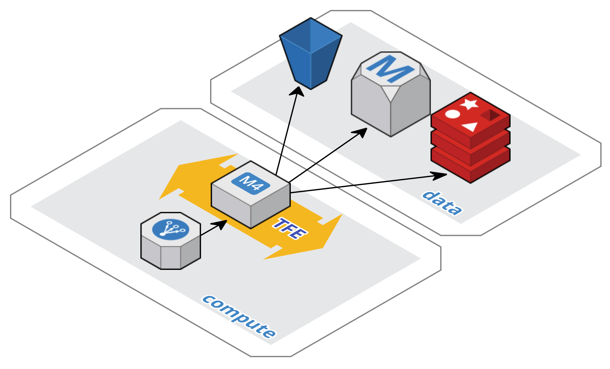

# Installing Terraform Enterprise

Terraform Enterprise currently targets Amazon Web Services environments. Support for additional infrastructure providers is planned.

## Amazon Web Services (AWS)

In AWS, a Terraform Enterprise install consists of:

 * Compute Tier
  * Elastic Load Balancer (ELB)
  * Single EC2 instance launched as part of an AutoScaling Group (ASG)
 * Data Tier
  * RDS PostgreSQL for primary application storage
  * ElastiCache Redis for ephemeral application storage
  * An S3 Bucket for object storage

### Primary Installation Config Files

The [`aws-standard`](aws-standard/) directory contains the primary Terraform Enterprise installation config files. Its [`README`](aws-standard/README.md) is the next step for learning about how to install Terraform Enterprise.

### Tertiary Terraform Configs

The [`aws-extra`](aws-extra/) directory contains supplamentary configs. Its [`README`](aws-extra/README.md) contains a list of descriptions of the configs available.

## Documentation

Further documentation about various aspects of the Terraform Enterprise install can be found in the [`docs`](docs/) subdir.
