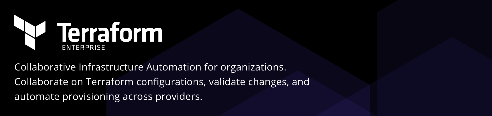

# Terraform Enterprise Modules

-----

## Deprecation warning:

The Terraform Enterprise AMI is no longer actively developed as of 201808-1 and will be fully decommissioned on November 30, 2018. As part of this deprecation, the modules and documentation in this repo are now unmaintained.

Please see our [Migration Guide](https://www.terraform.io/docs/enterprise/private/migrate.html) to migrate to the new Private Terraform Enterprise Installer.

-----

These are Terraform modules for setting up Terraform Enterprise inside a customer's infrastructure (aka Private Terraform Enterprise).

## Interested in Terraform Enterprise?

Visit the [product page](https://www.hashicorp.com/products/terraform/) for more information.

## Installing Terraform Enterprise?

See [INSTALLING.md](INSTALLING.md)
