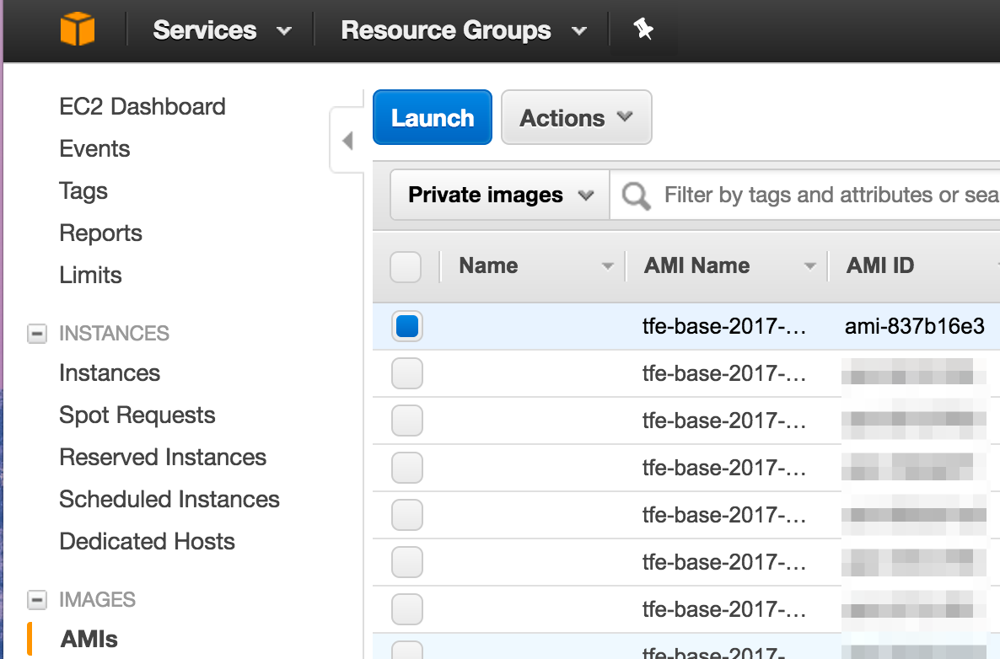
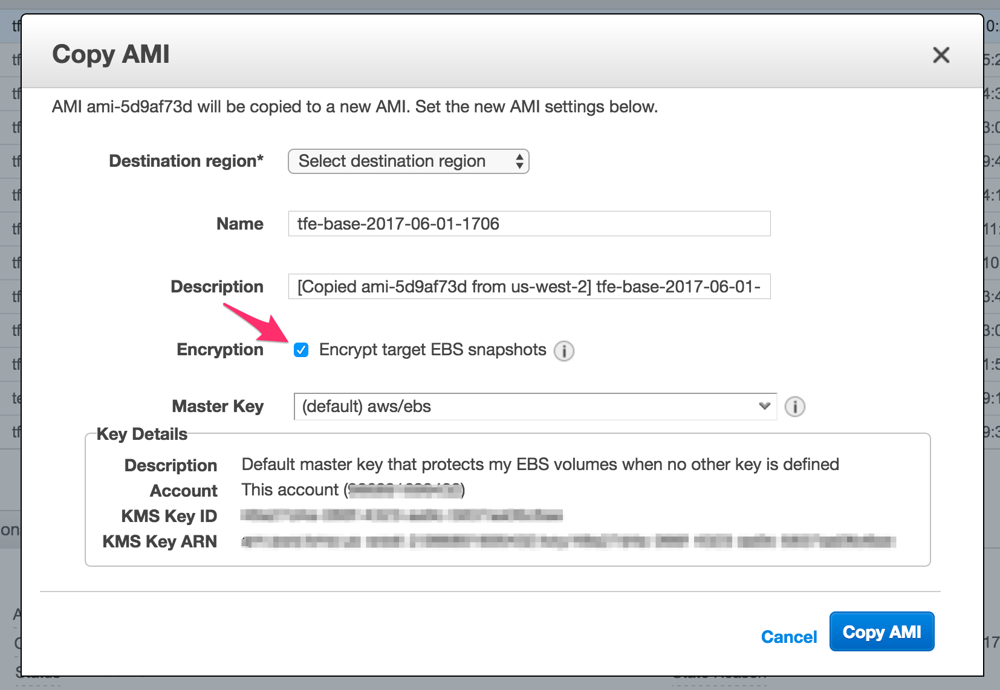

# Using an Encrypted AMI

If you wish to backup your instance using EBS snapshots with encryption,
you'll need to copy the official AMI to your account and configure it with
encryption.

In the AWS Console, go to AMIs under the EC2 subsystem. Change the selector to
"Private Images", and select the AMI you wish to make a copy of:

Then in the copy configuration, select Encryption:

And click *Copy AMI*. Once the copy operation is finished, you can use the
newly created AMI's ID in your `terraform.tfvars` file to install Terraform
Enterprise.
